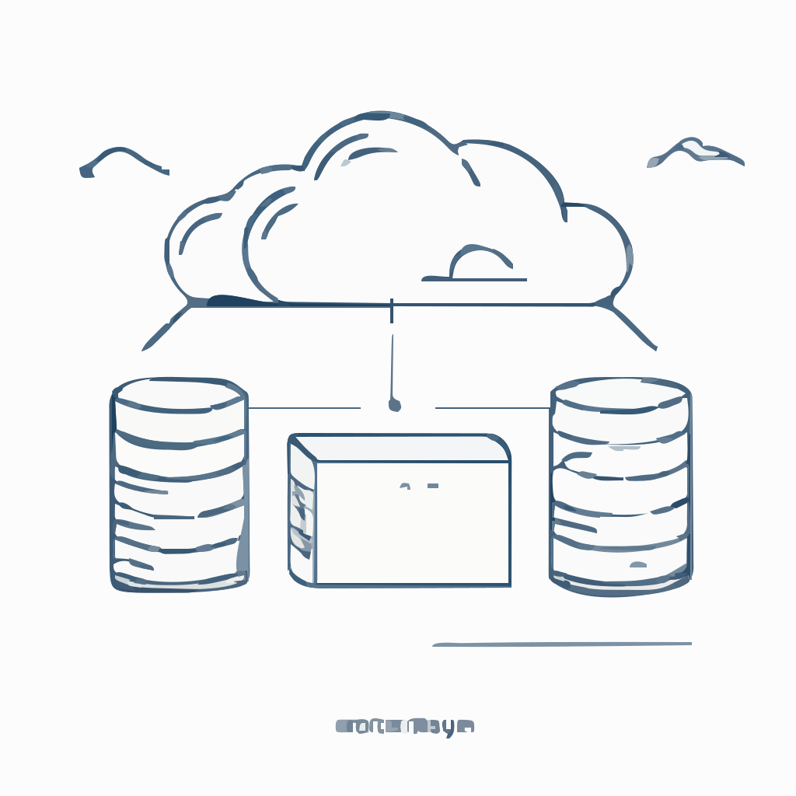

# Introduction
[](https://www.npmjs.com/package/item-store-redis)
[](https://www.npmjs.com/package/item-store-redis)
[](https://www.npmjs.com/package/item-store-redis)
[](https://www.npmjs.com/package/item-store-redis)
[](https://github.com/BackendStack21/item-store-redis.git)

  

This module provides classes that implement repositories for storing and retrieving data in a Redis database:

- `ItemRepository`: The class provides basic functionality for storing and retrieving individual items, as well as querying all items or a subset of items in a paginated manner. The items are stored in Redis using a key-value data model with expiration support. 
- `SortedItemRepository`: The class provides a more advanced functionality for storing and retrieving items in a sorted manner. The items are sorted based on a numeric score, and can be queried in a paginated manner as well. The items are stored in Redis using a sorted set data model, making it more performant and efficient at scale (see `demos/benchmark.ts`). However, this model does not supports automatic expiration.

```ts
import { ItemRepository, SortedItemRepository, SortedItem, IItem } from 'item-store-redis'
```

## Class ItemRepository

### Constructor
```ts
constructor (name: string, redis?: Redis | Cluster)
```

### Usage
```ts
import { ItemRepository } from 'item-store-redis'
import Redis from 'ioredis'

const redis = new Redis({ host: 'localhost', port: 6379 })
const repository = new ItemRepository('my-unsorted-repo', redis)
...
```

### Interface
```ts
interface IItemRepository {
  name: string
  redis: Redis | Cluster
  set(item: IItem, expirationInSeconds?: number): Promise<void>
  getById(id: string): Promise<IItem | null>
  getAll(): Promise<IItem[]>
  getPaginated(page: number, pageSize: number): Promise<IPaginatedItems>
  hasItem(id: string): Promise<boolean>
  deleteById(id: string): Promise<void>
  deleteAll(): Promise<void>
}
```

## Class SortedItemRepository

### Constructor
```ts
constructor (name: string, redis?: Redis | Cluster)
```

### Usage
```ts
import { SortedItemRepository, SortedItem } from 'item-store-redis'
import Redis from 'ioredis'

const redis = new Redis({ host: 'localhost', port: 6379 })
const repository = new SortedItemRepository('my-sorted-repo', redis)
...
```

### Interface
```ts
interface ISortedItemRepository {
  name: string
  redis: Redis | Cluster
  add(item: SortedItem): Promise<void>
  updateById(id: string, data: unknown): Promise<boolean>
  getById(id: string): Promise<IItem | null>
  getAll(): Promise<IItem[]>
  getPaginated(page: number, pageSize: number): Promise<IPaginatedItems>
  deletePage(page: number, pageSize: number): Promise<void>
  hasItem(id: string): Promise<boolean>
  deleteById(id: string): Promise<void>
  deleteAll(): Promise<void>
  count(): Promise<number>
}
```

# License

```
MIT License

Copyright (c) 2023 21no.de

Permission is hereby granted, free of charge, to any person obtaining a copy
of this software and associated documentation files (the "Software"), to deal
in the Software without restriction, including without limitation the rights
to use, copy, modify, merge, publish, distribute, sublicense, and/or sell
copies of the Software, and to permit persons to whom the Software is
furnished to do so, subject to the following conditions:

The above copyright notice and this permission notice shall be included in all
copies or substantial portions of the Software.

THE SOFTWARE IS PROVIDED "AS IS", WITHOUT WARRANTY OF ANY KIND, EXPRESS OR
IMPLIED, INCLUDING BUT NOT LIMITED TO THE WARRANTIES OF MERCHANTABILITY,
FITNESS FOR A PARTICULAR PURPOSE AND NONINFRINGEMENT. IN NO EVENT SHALL THE
AUTHORS OR COPYRIGHT HOLDERS BE LIABLE FOR ANY CLAIM, DAMAGES OR OTHER
LIABILITY, WHETHER IN AN ACTION OF CONTRACT, TORT OR OTHERWISE, ARISING FROM,
OUT OF OR IN CONNECTION WITH THE SOFTWARE OR THE USE OR OTHER DEALINGS IN THE
SOFTWARE.

```